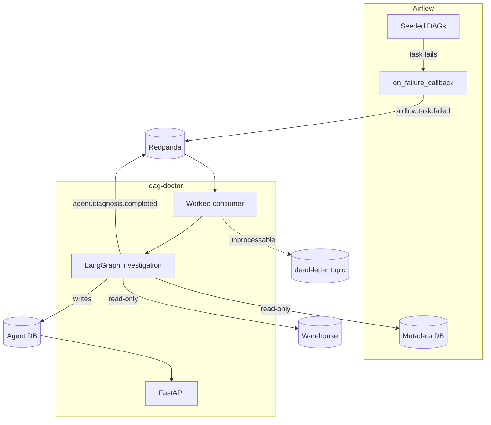
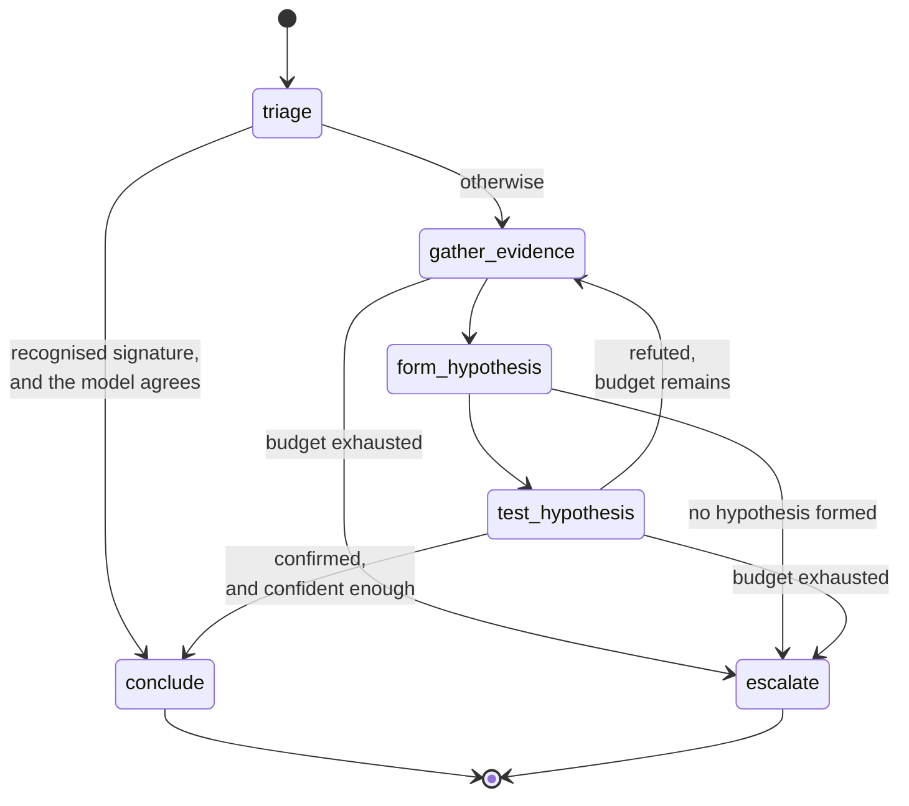

# dag-doctor

**An autonomous agent that diagnoses failing Airflow pipelines.** It consumes task failure
events, investigates them with read-only tools, tests its own hypotheses, and produces a
structured diagnosis with an evidence chain and a confidence score computed in code.

[](https://github.com/pratikahir/dag-doctor/actions/workflows/ci.yml)
[](https://www.python.org/downloads/)
[](LICENSE)
[](https://mypy-lang.org/)
[](https://github.com/astral-sh/ruff)

---

## A worked example

> **Not yet captured.** The stack has not been run against a live model, so there is no
> real trace to show here, and a hand-written one pretending to be output would be worse
> than an empty section. Produce it with:
>
> ```bash
> make up && make pull-models && make seed-failures
> make example                     # renders the schema-drift investigation as markdown
> ```
>
> The output of `make example` is generated from the live API and drops straight into this
> section. It shows the failure Airflow reported, the path the investigation took through
> the graph, what each tool found, **what was ruled out and what ruled it out**, and the
> final diagnosis with its computed confidence.

The scenario it writes up: an upstream job renames `raw.orders.customer_id` to
`customer_uuid`. A downstream aggregate still selects the old name and fails with
`UndefinedColumn`. The interesting part is that the error names `customer_id`, so the
obvious reading is "add the column back", while the actual answer is that the upstream
contract changed and the task genuinely at fault is `land_raw_orders`, not the one that
visibly failed.

## Accuracy

> **Not yet measured.** No evaluation run has been performed, so no numbers are published.
> This section stays empty rather than carrying a plausible-looking table, because a
> claimed accuracy figure is worth less than nothing.
>
> ```bash
> make evaluate                                    # the default provider, Ollama
> LLM_PROVIDER=anthropic make evaluate             # a frontier model, needs a key
> ```
>
> `make evaluate` triggers all eight seeded scenarios, waits for the diagnoses, and writes
> the table to `results/accuracy.md`. Run it against both a local and a frontier model and
> paste both tables here. The comparison is the point: small local models are noticeably
> weaker at multi-step tool selection, and showing the gap is more useful than hiding it.

The harness reports three things separately, and the reasons matter:

- **Category accuracy** and **attribution accuracy** apart, because naming the right kind
  of failure while blaming the wrong task is not a correct diagnosis. Only the scenarios
  that actually test attribution count towards the second number.
- **An inconclusive answer scores as wrong.** An agent that declines to answer has not
  diagnosed the failure, and averaging that away as partial credit makes the headline
  number meaningless.
- **A calibration gap**: mean confidence on wrong answers minus mean confidence on right
  ones. An agent that is surest when it is wrong is worse than one that is uniformly
  unsure, and a good average hides exactly that.

The control, `healthy_baseline`, is scored correct only when **no incident was produced at
all**. A noisy agent is an ignored agent, so a false positive costs the same as a wrong
diagnosis.

## Architecture



The investigation itself is a state machine, and the loop is the reason it is one:



## Quickstart

Zero cost, zero signup. The default provider is Ollama running locally.

```bash
make up              # postgres, redpanda, ollama, airflow, the agent API and worker
make pull-models     # llama3.2:3b, about 2 GB on first run
make seed-failures   # trigger all eight seeded DAGs
make logs            # watch the worker investigate

curl localhost:8000/api/v1/incidents | jq
curl localhost:8000/api/v1/incidents/<id>/investigation | jq
```

- Airflow UI: http://localhost:8080 (`airflow` / `airflow`)
- API docs: http://localhost:8000/docs
- Metrics: http://localhost:8000/metrics, and the worker's own on :9100

The first `make up` pulls several container images and `make pull-models` downloads roughly
2 GB of model weights. After that everything is local and free.

To use a frontier model instead, set `LLM_PROVIDER=anthropic` and `ANTHROPIC_API_KEY` in
`.env`. **No part of the test suite ever needs a key or a running Ollama.**

## How it works

An Airflow task fails. Its `on_failure_callback` publishes the failure to a Redpanda topic.
A worker consumes it, records an incident, and runs the investigation graph.

**Triage** classifies the failure from the exception alone, with no tools. It can end the
investigation immediately, but only when two independent things agree: a failure pattern
the code already recognises, *and* a model that classifies it the same way. Either alone is
not enough, because a confident wrong answer is the worst thing this agent could produce.

**Gather evidence** asks the model which tools to call, then calls them. The model chooses;
the node enforces. It caps calls against the remaining budget, and records every result
including the failures, because knowing a tool could not answer is information.

**Form hypothesis** proposes ranked causes. Each must carry a test, and the test is a *tool
call*, not a sentence. That constraint is what stops this step producing a confident
narrative: if no call could contradict the story, it is not a hypothesis. Anything already
refuted is named in the prompt so the loop does not circle back to it.

**Test hypothesis** runs the test, *then* asks the model to judge the result. In that order,
because asking a model to predict its own test's outcome lets it confirm anything.

If the hypothesis survives, **conclude** writes the diagnosis and the confidence is computed
from the shape of the investigation. If it is refuted, the graph goes **back to gather
evidence** with what it just learned. If a budget runs out, **escalate** produces an
inconclusive diagnosis saying what was found, what is still unknown, and which budget to
raise. It makes no model call, because spending tokens to write a nicer account of having
failed would defeat the budget that stopped it.

### Confidence is computed, not claimed

A model asked how sure it is answers around ninety percent whether it is right or wrong, in
the same tone either way. So nothing here reads a self-reported number. Confidence comes
from whether a known signature matched, whether a hypothesis survived a real test, how many
**independent tools** support it, and how many hypotheses were discarded first. Every
diagnosis records its own breakdown:

```
0.82 = 0.15 base + 0.20 signature + 0.30 test + 0.26 evidence +0.00 refutations
```

Distinct tools, not evidence items: calling one tool three times is one argument repeated,
and counting it three times would let an investigation manufacture its own support. The
formula and its limits are in [docs/confidence.md](docs/confidence.md).

### The nine tools

| Tool | Answers |
|---|---|
| `fetch_task_logs` | What did the task print? Parsed into exception, frames and tail |
| `get_dag_run_history` | Is this new or has it been failing for weeks? |
| `get_upstream_task_state` | Did a dependency fail, and which one broke *first*? |
| `get_dag_source` | What does the failing operator actually say? |
| `inspect_table_schema` | What columns does this table have now? |
| `compare_schema_snapshot` | What changed since we last looked, and was it a rename? |
| `profile_table` | Has the data changed shape, even though the schema has not? |
| `check_connection_health` | Is the database reachable at all? |
| `search_similar_incidents` | Have we seen and diagnosed this before? |

All database access is read-only, enforced in code rather than asked for in a prompt: tools
take a connection *name* and never a DSN, identifiers are validated instead of
interpolated, queries are built from reflected columns, and every transaction opens read-only
with a statement timeout. The agent writes to exactly one database, its own.

## Why the technology choices

**Why an event log, rather than a webhook.** A webhook couples Airflow to the agent: if the
agent is down when a task fails, the notification is gone. With a log, the agent can be
restarted or redeployed without losing incidents, other consumers can be added without
touching Airflow, and **incidents are replayable**. That last one is the strongest argument:
re-running the agent against a past failure after changing a prompt is how you find out
whether the change helped. Replays are stored beside the original, never over it.

**Why Redpanda, rather than Kafka.** Kafka protocol compatible, so the same client library,
topics, consumer groups and offsets, but one container instead of Kafka plus a coordination
layer. `docker compose up` time matters more for a repository people try than protocol
purity does. Switching to real Kafka is a change to one environment variable.

**Why LangGraph, rather than a chain.** Because of one edge:
`test_hypothesis -> gather_evidence`. A refuted hypothesis sends the investigation round
again, carrying what it just learned. A linear chain cannot express "go back and look
again, knowing that was wrong", and every honest investigation does exactly that. If the
graph had no cycle, this would be a chain with extra ceremony and the framework would not
be earning its place.

## Extending

Adding a tool is about twenty lines: a Pydantic input model, a typed output with a
one-line `summarise()`, and an `execute`. The base class handles validation, the timeout,
and turning any fault into a typed result, so a new tool cannot forget them. There is a
full worked example in [docs/adding-tools.md](docs/adding-tools.md).

Adding a failure scenario takes three things: the DAG, an entry in the answer key saying
what a correct diagnosis looks like, and its fixture data. Tests assert the DAGs and the
answer key cover the same set, so a scenario cannot be added without somebody deciding what
"correct" means for it.

## Limitations

Stated plainly, because you will find them anyway.

- **Small local models diagnose noticeably worse.** Multi-step tool selection is where they
  are weakest, and that is most of what this agent does. Ollama is the default because the
  quickstart should cost nothing, not because it is the best answer. Run the accuracy table
  against both and decide for yourself.
- **The agent proposes fixes; it never applies them.** Every tool is read-only and that is
  enforced in code. An agent that silently rewrites production DAGs is not something to
  ship as a demonstration. Auto-remediation is future work, and it should stay future work
  until the accuracy numbers justify it.
- **The eight scenarios are seeded, and real failures are messier.** Each one has a single
  clean cause. Real incidents arrive in clusters, with two things broken at once and a
  deploy in the middle. Accuracy here is an upper bound, not a forecast.
- **Confidence is a heuristic, not a calibrated probability.** The weights are chosen by
  judgement, not fitted to data. Until the feedback endpoint has collected real verdicts
  there is nothing to calibrate against. Treat the score as an ordering over diagnoses.
- **Airflow 2.10.** The compose topology, the `/api/v1` REST interface and the metadata
  schema are all Airflow 2. Airflow 3 changes all three; migrating is future work.
- **`search_similar_incidents` matches lexically, not semantically.** Deliberate: the
  tokens that identify a failure are literal identifiers like a column name, which exact
  overlap captures and embeddings blur. It also keeps the tool free and deterministic. If
  your failures are described in prose rather than stack traces, this is the first thing to
  change.

## Project structure

```
src/dag_doctor/
├── core/          settings, domain models, LLM factory, exceptions, logging, metrics
├── graph/         the state machine, its six nodes, routing, confidence, prompts
├── tools/         the nine read-only tools, the registry, the SQL guard
├── messaging/     wire schemas, producer, consumer, dead-letter path
├── db/            SQLAlchemy models, sessions, repositories
├── api/           FastAPI app, error envelope, routes
├── worker/        the consumer process and the investigator
└── evaluation/    seeded scenarios, runner, scorer
airflow/dags/      the eight seeded failure scenarios
deploy/helm/       the Helm chart, API and worker scaled separately
docs/              architecture, graph design, confidence, adding tools
```

## Documentation

- [Architecture](docs/architecture.md), and why there is an event log at all
- [The investigation graph](docs/graph-design.md), and why it loops
- [How confidence is computed](docs/confidence.md)
- [Adding a tool](docs/adding-tools.md)
- [The Helm chart](deploy/helm/dag-doctor/README.md)

## Contributing

See [CONTRIBUTING.md](CONTRIBUTING.md). `make check` is the gate, and it is what CI runs.

## Licence

MIT. See [LICENSE](LICENSE).
