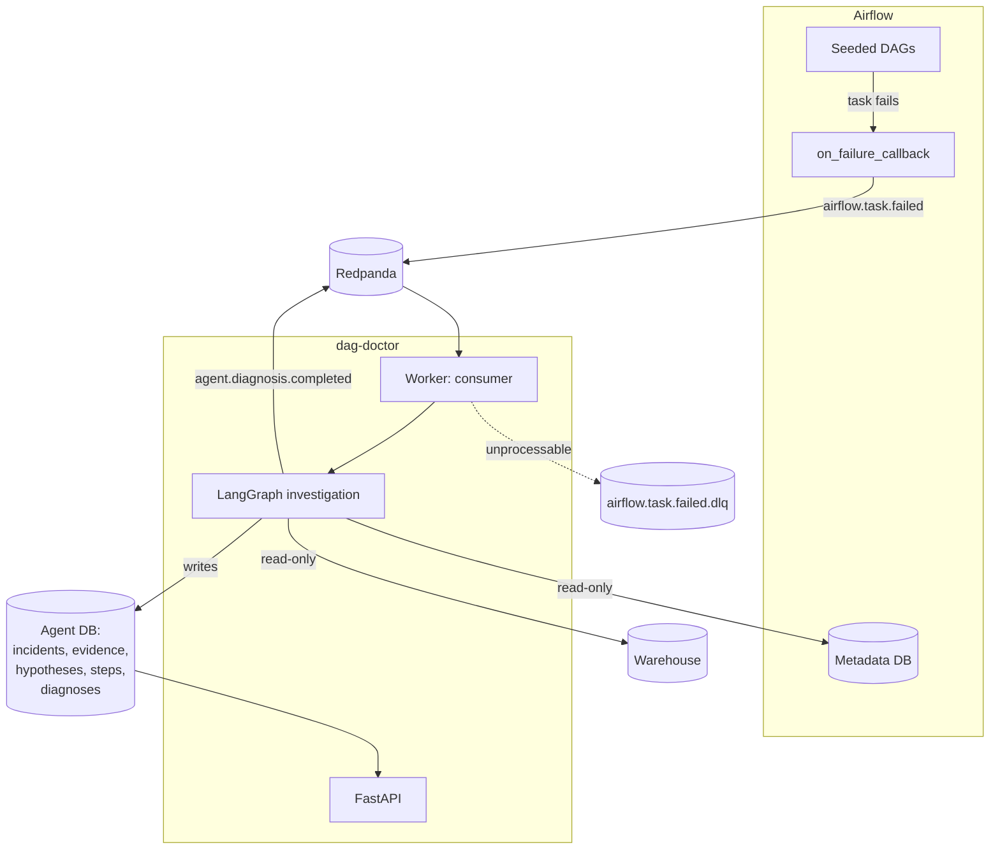

# Architecture

## The shape of it



Three databases, kept apart on purpose:

| Database | Access | Why separate |
|---|---|---|
| Airflow metadata | `SELECT` only | Airflow owns it. The agent is an observer, not a participant |
| Warehouse | `SELECT` only | The data the pipelines move, and what the agent inspects |
| Agent's own | Read and write | The agent's memory: incidents, evidence, traces, diagnoses, snapshots |

The agent writes to exactly one of them. Putting the fake warehouse tables in the agent's
own database would let it inspect its own state and mistake that for evidence about a
pipeline.

## Why an event log between Airflow and the agent

A webhook would couple them: if the agent is down when a task fails, the notification is
gone and nobody finds out. With a log:

- The agent can be restarted, redeployed, or scaled without losing incidents.
- **Incidents are replayable.** Re-running the agent against a past failure after changing
  a prompt is how you tell whether the change helped, and it is the strongest argument for
  this design. Replays are stored beside the original rather than over it.
- Alerting, metrics or a ticket opener can consume the same events without touching
  Airflow.

Offsets are committed manually, only after the database transaction commits. A crash can
therefore reprocess a failure but never acknowledge one it did not record, and idempotency
on the failure's identifying tuple makes reprocessing harmless.

## Why Redpanda rather than Kafka

Kafka protocol compatible: the same client library, the same topics, the same consumer
groups and offsets. It ships as one container instead of Kafka plus a coordination layer,
and `docker compose up` time matters more for a repository people try than protocol purity
does. Swapping in Kafka is a change to `KAFKA_BOOTSTRAP_SERVERS`.

## Topics

| Topic | Producer | Consumer | Payload |
|---|---|---|---|
| `airflow.task.failed` | Airflow callback | Worker | The failed task instance and its exception |
| `agent.diagnosis.completed` | Worker | Open for extension | Incident id, root cause, confidence |
| `airflow.task.failed.dlq` | Worker | Nobody, by design | Messages that could not be processed, with why |

The failure topic is partitioned by `dag_id/task_id/run_id/map_index`, so every attempt at
one task instance lands on one partition and is seen in order.

## Two processes, one image

The API and the worker are the same build with different entrypoints. They scale on
different things: the API on request load, the worker on how far behind the failure topic
it is. Running them as one process would mean scaling a slow investigation loop to serve a
fast read endpoint.

Each exposes its own Prometheus endpoint, because they are separate processes with
separate registries.

## Where the parts live

```
src/dag_doctor/
├── core/          settings, domain models, LLM factory, exceptions, logging, metrics
├── graph/         the investigation state machine, its nodes, routing and confidence
├── tools/         the nine read-only tools, the registry and the SQL guard
├── messaging/     wire schemas, producer, consumer, dead-letter path
├── db/            SQLAlchemy models, session handling, repositories
├── api/           FastAPI app, error envelope, routes
├── worker/        the consumer process and the investigator that drives the graph
└── evaluation/    the seeded scenarios, the runner and the scorer
```

Further reading: [the graph design](graph-design.md), [how confidence is
computed](confidence.md), [adding a tool](adding-tools.md).
