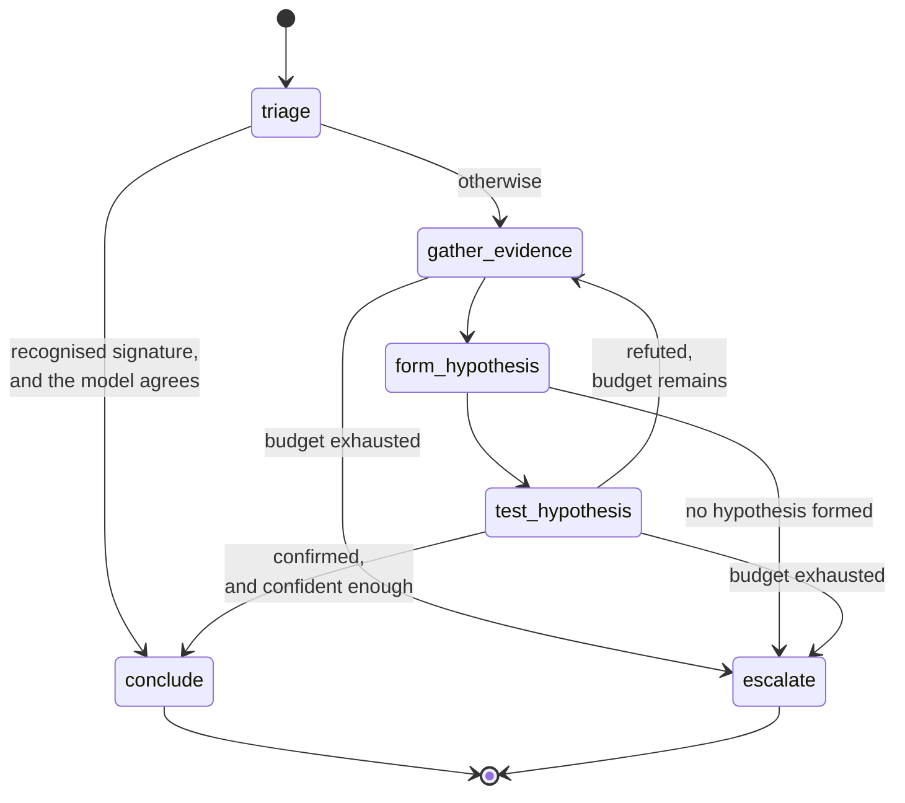

# The investigation graph

## The shape



The edge that matters is `test_hypothesis -> gather_evidence`. A refuted hypothesis sends
the investigation round again with what it has just learned. That cycle is why this is a
state machine and not a chain, and it is the honest justification for using LangGraph at
all: a linear pipeline cannot express "go back and look again, knowing that was wrong".

## The nodes

**`triage`** classifies the failure from the event alone. No tools, one small model call.
Its real job is deciding whether the investigation is needed, and the bar for saying no is
deliberately high: a failure pattern the code already recognises **and** a model that
classifies it the same way. Either alone is not enough, because skipping an investigation
on a wrong classification produces a confident wrong answer, which is the worst outcome
available to this agent.

**`gather_evidence`** asks the model which tools to call, then calls them. The model
chooses; the node enforces. It caps the calls against the remaining budget, so a model that
asks for nine tools when four calls remain gets four. Every result is recorded, including
the failures: knowing a tool could not answer is information, not an absence.

**`form_hypothesis`** proposes ranked causes. Each one must carry a test, and the test is a
tool call rather than a sentence. That constraint is what stops this node producing a
confident narrative: if no call could contradict the story, it is not a hypothesis.
Already-refuted hypotheses are named in the prompt so the loop does not circle back to
them.

**`test_hypothesis`** runs the test, then asks the model to judge the result. In that
order, because asking a model to predict its own test's outcome lets it confirm anything.

**`conclude`** writes the diagnosis. The prompt explicitly forbids the model from stating a
confidence, because a number it invents looks exactly as authoritative as a real one.
Confidence is [computed in code](confidence.md) from the shape of the investigation.

**`escalate`** makes no model call at all. The budget is gone or nothing survived its test,
and spending tokens to write a nicer summary of having failed would defeat the budget that
brought us here. It reports `unknown` even when a signature matched: an inconclusive result
that names a plausible cause reads as an answer and would score as one. What was suspected
goes in the summary, and what is missing goes in `unknowns` along with which budget to
raise.

## Budgets

Two hard limits, both enforced by routing rather than by hope:

| Budget | Default | Meaning when it runs out |
|---|---|---|
| `MAX_ITERATIONS` | 5 | The failure was ambiguous |
| `MAX_TOOL_CALLS` | 20 | The failure was expensive to investigate |

They are reported separately because they say different things and point at different
knobs. Hitting either is a **legitimate terminal state**: the investigation ends with an
inconclusive diagnosis carrying whatever it gathered. It is not a crash, and it is not a
fabricated answer.

## Why every node is testable without a model

Nodes reach a model through a single interface. The tests supply a caller that returns
prepared answers, and the nodes cannot tell the difference, so routing, the loop and budget
exhaustion are all verified against the real nodes and the real edges with no network call,
no API key and no Ollama running.

That is a design constraint, not a testing trick. A node that cannot be driven this way has
a design problem.

## Per-node model selection

Triage is a cheap classification a 0.5B model handles. Forming a hypothesis from a dozen
pieces of evidence is not. Each node can be pointed at its own model:

```bash
LLM_MODEL_TRIAGE=qwen2.5:0.5b
LLM_MODEL_FORM_HYPOTHESIS=llama3.1:8b
```

Unset falls back to the provider default. The Ollama startup probe checks every model the
configuration could select, not just the default, so a typo in an override fails at startup
rather than three nodes into an investigation.

## Persistence and replay

Every node execution is written to `investigation_steps` with its inputs, outputs, duration
and token spend, which is what the `/investigation` endpoint serves. The whole
investigation, steps and evidence and hypotheses and diagnosis, is persisted in one
transaction, so a crash leaves either nothing or a complete record, never a diagnosis whose
evidence is missing.

Replays are numbered and stored beside the original. Comparing a changed prompt against the
run it replaced is the point, and overwriting would defeat it.
